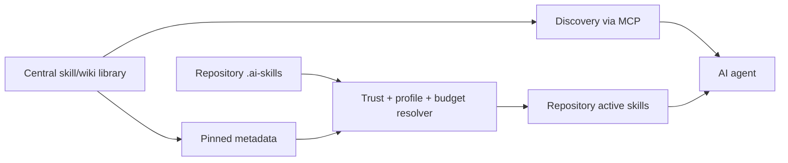

# ai-skills

> Central skills and durable knowledge for AI agents, without loading the whole library into every context window.

[](LICENSE)

**Status:** pre-alpha / architecture and implementation planning. The repository is not yet a usable release.

`ai-skills` is designed to give Claude Code, OpenAI Codex, Cursor, Gemini CLI and other MCP-capable agents one shared library of reusable skills and knowledge while keeping startup context bounded.

Instead of copying every instruction into every repository, it separates knowledge into three practical states:

1. **Pinned**, lightweight global instructions/metadata that should always be available.
2. **Repository active**, skills explicitly requested by the current repository through `.ai-skills` and materialized after trust/context checks.
3. **Discovery only**, the rest of the central library, searchable and retrievable through MCP only when needed.



## Why

AI coding tools increasingly support reusable skills, rules and project instructions, but those assets are fragmented across clients and repositories. Loading a large library at startup wastes context; keeping everything only on disk makes it difficult to discover, version, share and evolve.

`ai-skills` aims to provide one canonical, versioned library while exposing only the minimum relevant context to each agent and repository.

## Repository configuration

A repository can request additional active skills through a versioned `.ai-skills` file:

```json
{
  "version": 1,
  "active_skills": ["python-best-practices", "pytest-patterns"],
  "inherit_global_defaults": true
}
```

Repository configuration is treated as **untrusted input**. It may request a skill, but it cannot grant trust to itself, bypass approval, inject credentials or silently authorize third-party instructions.

## Safety model

The project is intentionally conservative about behavior-changing knowledge:

- third-party source provenance is preserved;
- discovery relevance is not treated as trust;
- LLMs and agents may **propose** skill changes, but machine-originated changes are never auto-applied;
- every machine-proposed mutation must show a reviewable diff and receive explicit human approval;
- canonical skill/wiki content is Git-versioned and recoverable;
- secrets must not be persisted into skills, embeddings, logs or proposal evidence.

See [SECURITY.md](SECURITY.md) for the security invariants.

## Installation

There is no supported installation yet. Do not clone `main` expecting a working tool.

The v0 release must provide a low-friction installation surface and verified prebuilt artifacts before the project is considered ready for general use. Packaging work is tracked in [#59](https://github.com/Alexandre-Tortoza/ai-skills/issues/59) and build-once/repackage-many distribution in [#64](https://github.com/Alexandre-Tortoza/ai-skills/issues/64).

## Roadmap

The product Epic is [#3](https://github.com/Alexandre-Tortoza/ai-skills/issues/3). Delivery is split into milestones covering foundation, canonical storage, search, MCP/API, repository sync, LLM-assisted evolution, dashboard, hardening and release.

GitHub Issues contain executable engineering specifications. Milestones and native issue relationships represent delivery sequencing; the single GitHub Project **ai-skills Roadmap** is the planning surface for status, priority, Fibonacci weight, estimate, area and target release.

## Documentation

Start at [`docs/index.md`](docs/index.md).

Key documents:

- [Open-source readiness](docs/open-source-readiness.md)
- [Project management model](docs/project-management.md)
- [Release policy](docs/releasing.md)
- [Security policy](SECURITY.md)
- [Contributing](CONTRIBUTING.md)
- [Agent instructions](AGENTS.md)

Architecture and feature-specific documentation will grow with the implementation rather than being invented ahead of verified behavior.

## Contributing

Contributions are welcome, but the project is still in the foundation phase. Read [CONTRIBUTING.md](CONTRIBUTING.md) before starting non-trivial work and prefer an existing issue so scope, acceptance criteria and architectural constraints are explicit.

Security-sensitive changes require extra review because this tool processes repository-controlled instructions, third-party content and agent/LLM proposals.

## License

MIT. See [LICENSE](LICENSE).
