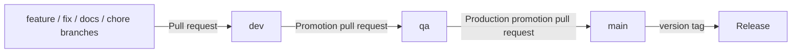

# Branching and promotion strategy

`ai-skills` uses three long-lived environment branches and short-lived topic branches.

## Long-lived branches

| Branch | Purpose | Accepted pull requests |
| --- | --- | --- |
| `dev` | Integration branch for normal development | Topic branches and forks |
| `qa` | Release-candidate and validation branch | `dev` only |
| `main` | Production/source of stable releases | `qa` only |

`main` remains the repository default branch because it represents the stable public state of the project. Contributors should normally target `dev`.

## Rules

All three long-lived branches must be protected by GitHub repository rulesets.

- Changes arrive through pull requests.
- Force pushes are forbidden.
- Branch deletion is forbidden.
- Review conversations must be resolved before merge.
- The `Validate promotion path` status check is required and strict.
- `qa` only accepts a promotion PR from the repository's `dev` branch.
- `main` only accepts a production promotion PR from the repository's `qa` branch.
- Topic/fork pull requests target `dev`.

The repository intentionally starts with zero mandatory approvals so a solo maintainer is not locked out. Once a second active maintainer exists, the production ruleset should be tightened to require at least one independent approval and, where appropriate, CODEOWNERS review.

## Merge methods

Topic branches into `dev` may use squash, rebase or merge according to the change. Promotions `dev -> qa` and `qa -> main` use merge commits so the promoted branch ancestry remains explicit and subsequent promotions remain straightforward.

## Hotfixes

Production fixes still follow the controlled flow. Create a hotfix topic branch from the current `main`, apply the fix, and merge it through `dev -> qa -> main`. If an emergency policy is introduced later, it must be represented explicitly in the repository ruleset and audit trail rather than relying on untracked direct pushes.

## GitHub rulesets

Desired branch rules are versioned under `.github/rulesets/`. GitHub does not apply these JSON files automatically. The manual workflow `.github/workflows/apply-branch-rulesets.yml` creates or updates the native repository rulesets.

That workflow requires a repository secret named `REPOSITORY_ADMIN_TOKEN` containing a fine-grained token with **Administration: write** permission for this repository. This permission is required by GitHub's repository-rulesets API.

After applying the rulesets, GitHub should report `dev`, `qa` and `main` as protected. The `Your main branch isn't protected` warning is then resolved by the active `main` ruleset.

## Future tightening

As implementation CI is added, the managed rulesets should also require the stable, always-running CI gate in addition to branch-flow validation. Do not require a conditional/path-filtered status check because a required check that does not run can permanently block a pull request.
