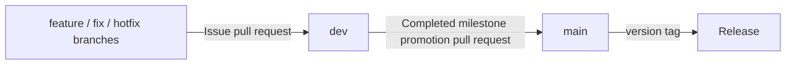

# Branching and promotion strategy

`ai-skills` uses two long-lived branches and one short-lived branch per issue.

## Long-lived branches

| Branch | Purpose | Accepted pull requests |
| --- | --- | --- |
| `dev` | Integration branch for issue work | `feature/*`, `fix/*`, `hotfix/*`, and forks |
| `main` | Production/source of stable releases | `dev` only |

`main` remains the repository default branch because it represents the stable public state of the project. Contributors should normally target `dev`.

## Rules

Both long-lived branches must be protected by GitHub repository rulesets.

- Changes arrive through pull requests.
- Force pushes are forbidden.
- Branch deletion is forbidden.
- Review conversations must be resolved before merge.
- The `Validate promotion path` status check is required and strict.
- One `feature/*`, `fix/*`, or `hotfix/*` branch represents one issue and targets `dev`.
- `dev` allows auto-merge after required checks, without an approving review.
- When every issue in a milestone is merged into `dev`, a maintainer opens one promotion pull request from `dev` to `main`.
- `main` only accepts that promotion pull request from the repository's `dev` branch and requires human approval before manual merge.

The integration branch intentionally requires zero approvals. The production ruleset requires one approval for the milestone promotion so it cannot merge automatically.

## Merge methods

Issue branches into `dev` may use squash, rebase, or merge according to the change. The `dev -> main` milestone promotion uses a merge commit so the promoted branch ancestry remains explicit.

## Hotfixes

Production fixes still follow the controlled flow. Create a `hotfix/<name>` branch, merge it into `dev`, then include it in the next completed-milestone promotion to `main`. If an emergency policy is introduced later, it must be represented explicitly in the repository ruleset and audit trail rather than relying on untracked direct pushes.

## GitHub rulesets

Desired branch rules are versioned under `.github/rulesets/`. GitHub does not apply these JSON files automatically. The manual workflow `.github/workflows/apply-branch-rulesets.yml` creates or updates the native repository rulesets.

That workflow requires a repository secret named `REPOSITORY_ADMIN_TOKEN` containing a fine-grained token with **Administration: write** permission for this repository. This permission is required by GitHub's repository-rulesets API.

After applying the rulesets, GitHub should report `dev` and `main` as protected. Repository auto-merge must remain enabled for `dev`; the `Disable main auto-merge` workflow cancels auto-merge for every promotion to `main`, which must receive human approval and a manual merge. The `Your main branch isn't protected` warning is then resolved by the active `main` ruleset.

## Future tightening

As implementation CI is added, the managed rulesets should also require the stable, always-running CI gate in addition to branch-flow validation. Do not require a conditional/path-filtered status check because a required check that does not run can permanently block a pull request.
